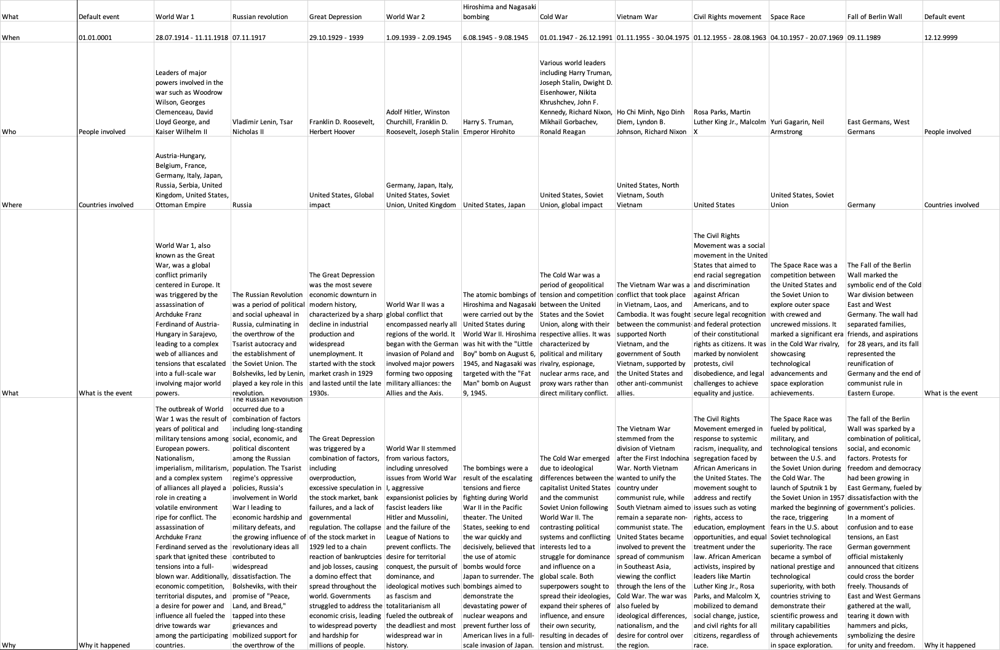

# HistoryHelper
This code will help you in creating your personal history revision book with all needed information about historic events. You will be able to add any events you want by just typing its name in the console. The end result will look like this:


## Usage guide:
1. Download the HistoryHelper folder, and open it in your editor. 
2. Run this line of code in terminal to install all libraries: ```pip install openai openpyxl datetime``` if you are using python2, and ```pip3 install openai openpyxl datetime``` if you are using python3. 
3. Open the AI.py file and specify your openai api key and the path to the excel file.
4. Run the code and input the name of historic event that you want to add information about. The code will find the info about the event and upload it to the file automatically.
5. Open your excel file, and see the event details in there. (I recommend enabling the text wrapping, setting the default column width to 20, and auto fit row height)

Remember that the file structure should be as in BaseFile, otherwise the code will work improperly. Do not forget to delete all empty columns when you delete information about any event. Do not delete the default events, they are used as timeline borders.
